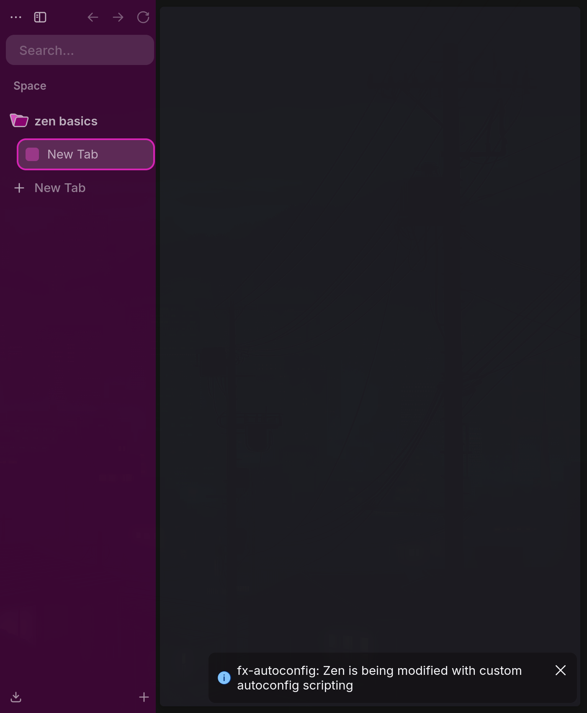
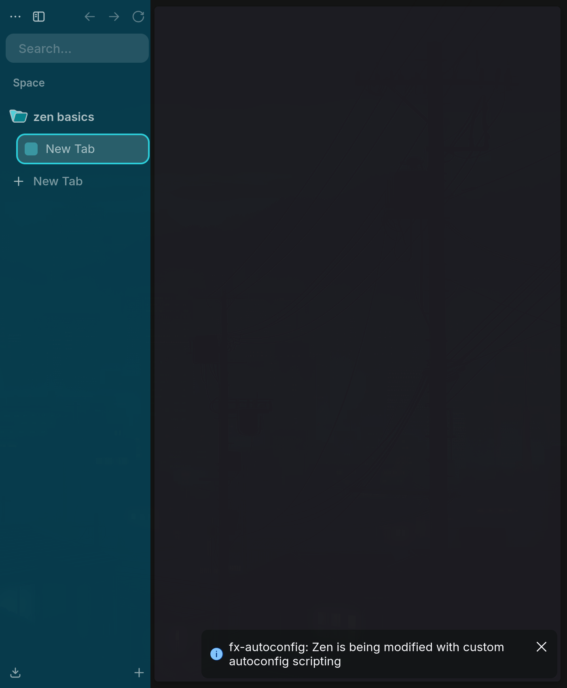

# Proof of concept report

Date: 2026-08-22

> Historical report: this document records the initial backend experiment. It does not qualify the current release. See the [current release validation](validation.md) for the complete test of Omazen `1.0.0` after all subsequent fixes.

## Result

The proof succeeded. Zen changed visible chrome colors after an atomic JSON replacement while the browser window remained open and retained the same process ID. No window was reopened and Zen was not restarted between palette A and palette B.

The packaged MVP was then exercised separately and produced the same hot-reload event through the final CLI-generated schema and final bridge.

## Test environment

| Component | Observed value |
|---|---|
| Omarchy | `4.0.0-1` |
| Active theme | Osaka Jade |
| Zen package | `zen-browser-bin 1.21.15b-1` |
| Zen binary | `/opt/zen-browser-bin/zen` |
| Zen build ID | `20260818101929` |
| Gecko milestone | `154.0` |
| Zen source stamp | `cee4147767801299dec330c81318c01e5a39e6ec` |
| fx-autoconfig | commit `dfdab5684faffc112b76ccb1d8cab7f75da0102c`, loader `0.10.16` |

## Isolation and reversibility

The installed `/opt/zen-browser-bin` tree and normal Zen profile were not modified.

1. `/opt/zen-browser-bin` was copied to `/tmp/omazen-poc/app`.
2. fx-autoconfig program files were added only to that temporary application copy.
3. A new profile was created under `/tmp/omazen-poc/profile`.
4. A minimal privileged script read a fixed JSON file in that profile, validated `schema_version`, `mode`, `accent` and `background`, and polled at 250 ms.
5. The temporary application copy was launched with `--no-remote --profile ...`.
6. The temporary window was closed with a normal interrupt after the test. The user's existing Zen process remained open.

## Observations

The first palette used `background=#3b0734` and `accent=#ff2bd6`. The bridge log recorded:

```text
BRIDGE_LOADED
APPLIED accent=#ff2bd6 background=#3b0734
```

The palette file was then written to a sibling temporary file and renamed over the watched file. About 210 ms later the same bridge logged:

```text
APPLIED accent=#37f2ff background=#073b4c
```

Hyprland reported PID `17624` before and after. The before and after captures show the same open Zen window changing its sidebar, selected tab outline and controls.

| Before | After |
|---|---|
|  |  |

The final packaged bridge was subsequently installed into another disposable profile. It logged `BRIDGE_LOADED version=0.1.0`, applied `#ffb000`, then applied `#36e1ff` after `omazen sync`; the disposable Zen window retained PID `26420`. A final clean start logged `CHROME_CSS_APPLIED primary=#36e1ff` from the computed chrome style. This second run validated the final external CSS URI, strict ten-key schema, installer layout and 250 ms watcher together.

## Decision

fx-autoconfig works with the tested Zen build, so the privileged backend remains the MVP architecture. A WebExtension/native-messaging backend is not needed as a fallback for this release. The initial restart remains necessary to activate autoconfig; subsequent theme changes are truly live.
