# Current release validation report

Date: 2026-08-24
Release: Omazen `1.0.0`

## Result

The current release passed the complete functional and visual validation below. This report supersedes the initial proof-of-concept report as the release-level test record; the PoC remains available only as historical evidence for the original backend decision.

The test covered dark and light palettes, live palette changes in both directions, live disable/enable, a normal Zen restart, every Settings subsection visible in the tested build, dialogs, Library, Passwords, Print, Developer Tools from More Tools, web scrollbars, and a real update/uninstall/clean-install cycle. The final state is Omazen installed and enabled, Zen running, and the original Osaka Jade theme restored.

## Environment

| Component | Observed value |
|---|---|
| Omazen | `1.0.0` |
| Omarchy | `4.0.0-1` (Quattro) |
| Zen package | `zen-browser-bin 1.21.15b-1` |
| Zen build ID | `20260818101929` |
| Gecko milestone | `154.0` |
| fx-autoconfig | loader `0.10.16`, commit `dfdab5684faffc112b76ccb1d8cab7f75da0102c` |
| Dark palette | Osaka Jade: `mode=dark`, `accent=#509475`, `background=#111c18` |
| Light palette | Catppuccin Latte: `mode=light`, `accent=#1e66f5`, `background=#eff1f5` |
| Zen profiles | 2 profiles from the active `profiles.ini` |

## Functional matrix

| Area | Exercise and observation | Result |
|---|---|---|
| Dark theme | Started with Osaka Jade and inspected browser chrome, Settings controls, text, focus states, cards and scrollbars. | Pass |
| Light theme | Switched to Catppuccin Latte and repeated the same surface checks. | Pass |
| Live theme change | Osaka Jade → Catppuccin Latte kept Zen PID `4311`; the bridge logged `PALETTE_APPLIED accent=#1e66f5 mode=light` followed by `CHROME_CSS_APPLIED`. After the clean install, Catppuccin Latte → Osaka Jade kept PID `21651` and produced the corresponding dark events. | Pass |
| Disable and enable | `omazen disable` logged `DISABLED` and reverted open chrome and Developer Tools without changing PID `4311`. `omazen enable` reapplied the light palette and logged the CSS probe with the same PID. | Pass |
| Zen restart | The last Zen window was closed normally and Zen was reopened. PID changed from `4311` to `16534`; the new process logged `BRIDGE_LOADED version=1.0.0`, `PALETTE_APPLIED` and `CHROME_CSS_APPLIED`. | Pass |
| Settings | Opened all 16 subsections visible in this build: Look and Feel, Tab Management, Keyboard Shortcuts, Zen Mods, Account and sync, Home and startup, Search, Privacy and security, Passwords and autofill, Appearance, Downloads, Tabs and browsing, Accessibility, Languages, Permissions and data, and About Zen. | Pass |
| Dialogs | Opened the Clear browsing data and cookies modal, checked the surface, labels, checkboxes, selector and primary/secondary actions, then cancelled it without deleting data. | Pass |
| Library | Opened the separate Library window and checked History, Downloads, Tags, bookmark tree, toolbar, search and empty state. | Pass |
| Passwords | Opened `about:logins` and checked its search, list/sidebar, empty state and Sync action. The tested profile contained zero saved passwords, so no credential data was displayed or captured. | Pass |
| Print | Opened Print on the local scrollbar fixture; checked preview, destination, orientation, pages, color mode, More settings, system-dialog link and Save/Cancel actions. No print or PDF job was submitted. | Pass |
| More Tools | Opened the Inspector from Developer Tools and checked the docked toolbox, tabs, notification bar, DOM tree, rules and computed/layout panels. Disable/enable was also exercised while the toolbox was open. | Pass |
| Web scrollbars | Opened the local `file:` fixture with deliberate vertical and horizontal overflow. The browser-provided thumb/track followed the Omazen palette while the document background and content retained their native colors. | Pass |
| Automated regression suite | `tests/test.sh` completed all six TAP scenarios, including disposable setup, update backup, enable/disable, ownership-aware uninstall, conflict refusal and the top-level application lifecycle. | Pass |
| Real update | Ran `./install.sh` over the active installation. It created `~/.local/share/omazen.backup.20260824T163901Z`, reused matching privileged/profile files, synchronized the palette and completed with zero doctor failures. | Pass |
| Real uninstall | Closed Zen, ran `./uninstall.sh`, and verified that the command link, application copy, state, hook, owned profile runtime and three owned program files were absent. | Pass |
| Clean install | Ran `./install.sh` from an uninstalled state, verified source/installed SHA-256 equality for all three program files, and reopened Zen as PID `21651`. The final bridge log contained no error and `omazen doctor` reported `0 failure(s), 0 warning(s)`. | Pass |

## Visual evidence

### Dark and light Settings

| Osaka Jade (dark) | Catppuccin Latte (light) |
|---|---|
| 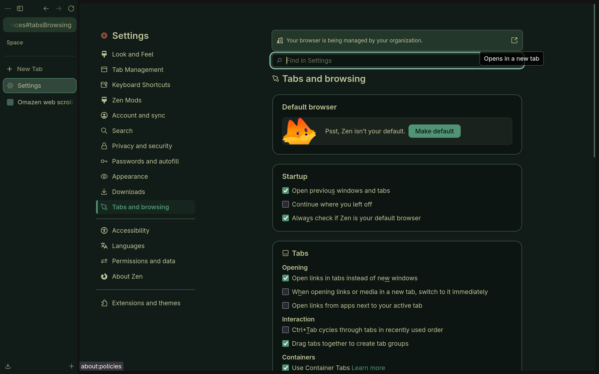 | 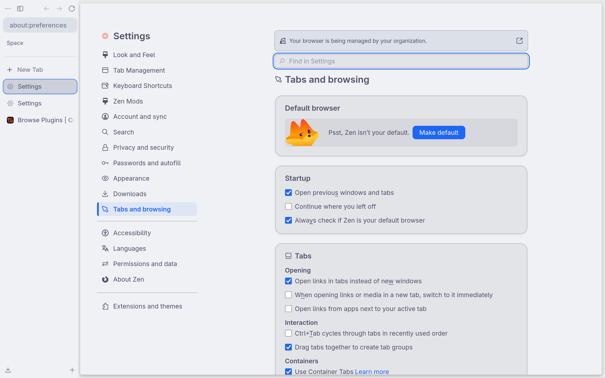 |

### Every visible Settings subsection

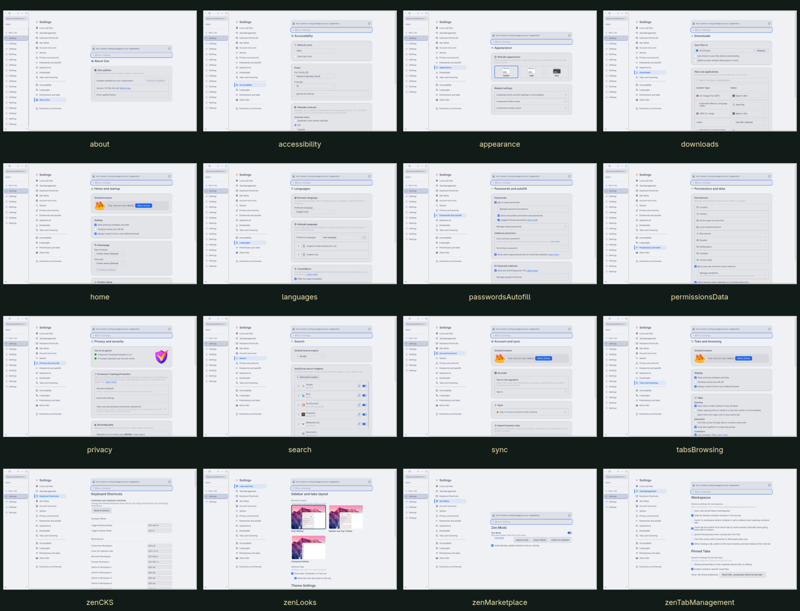

### Auxiliary surfaces

| Dialog | Library | Passwords |
|---|---|---|
| 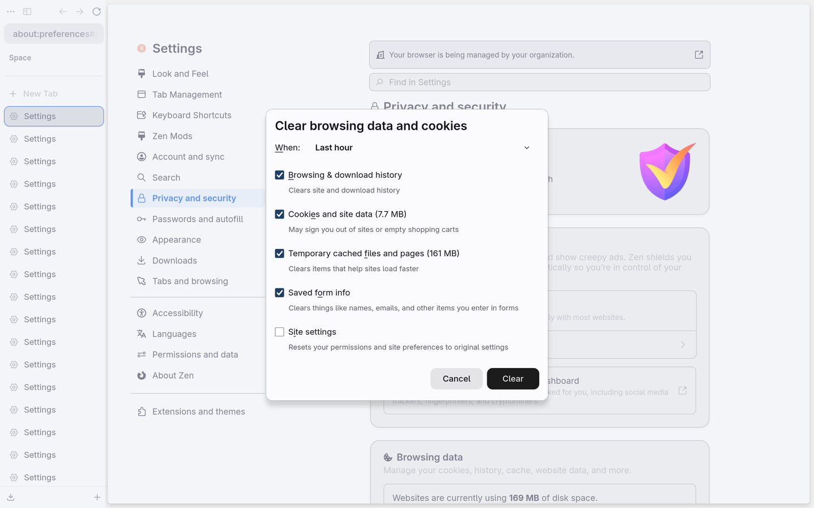 | 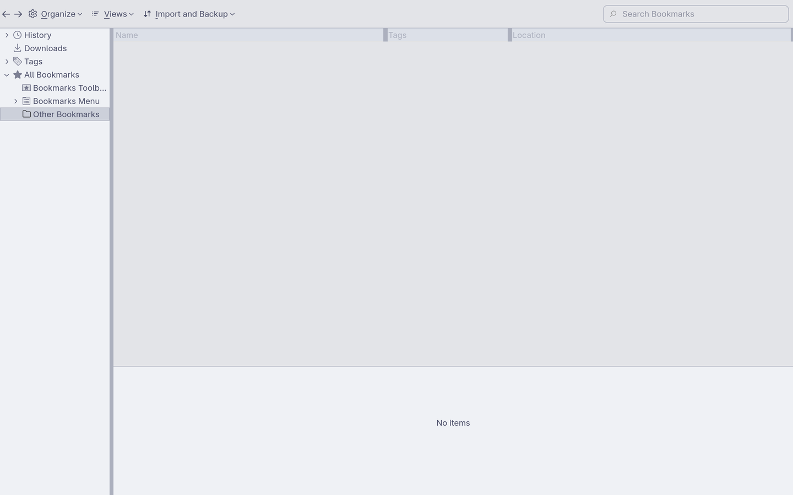 | 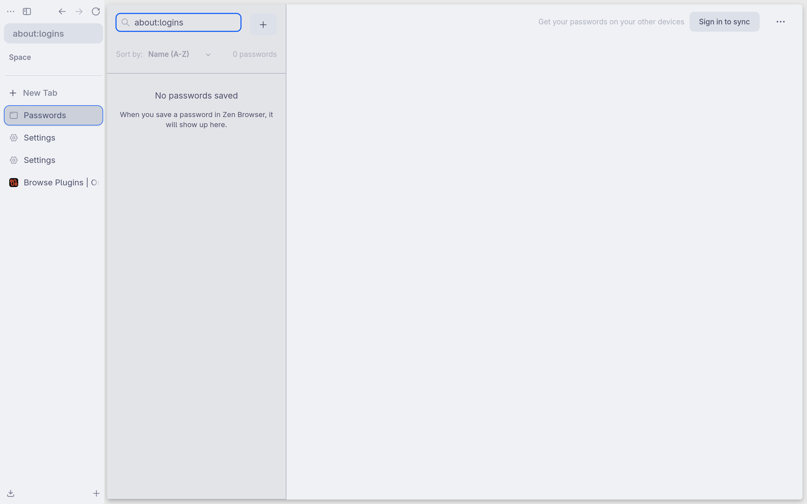 |

| Print | More Tools / Developer Tools | Web scrollbars |
|---|---|---|
| 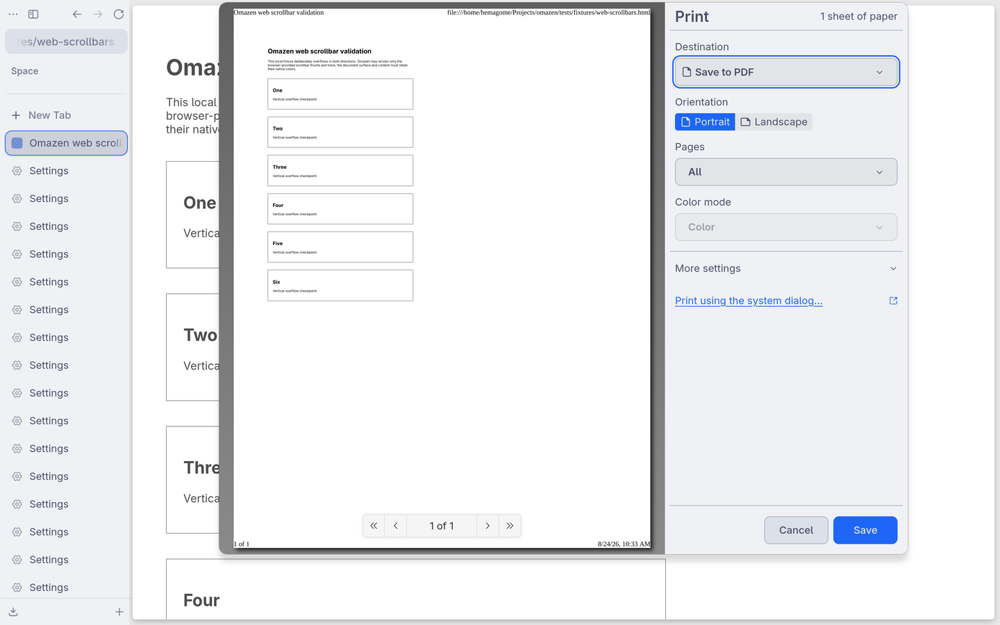 | 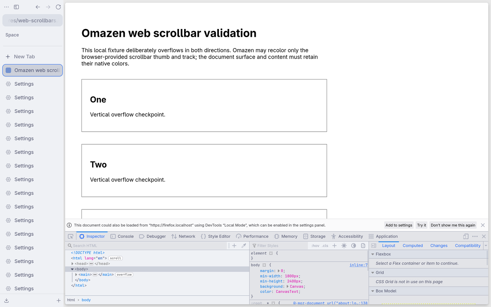 | 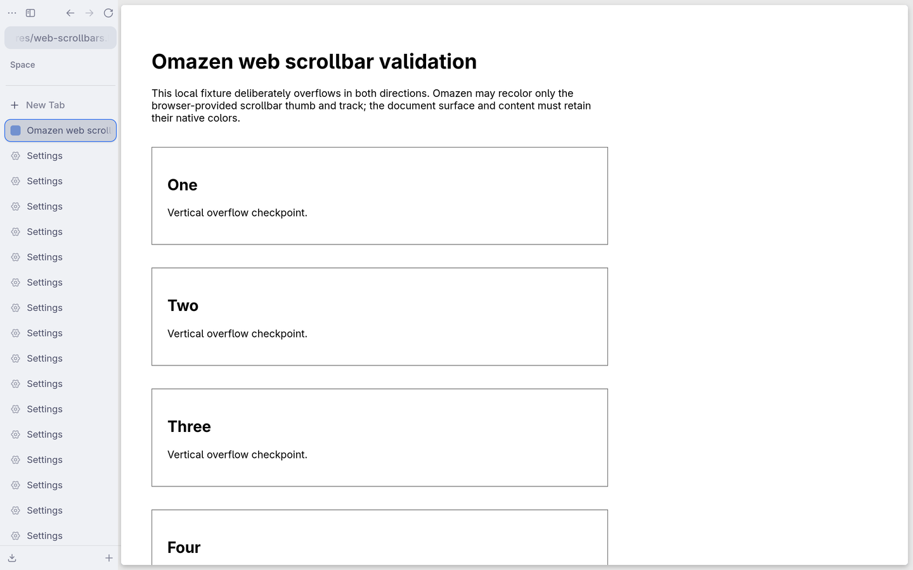 |

### Live state and restart

| Disabled | Re-enabled | After restart |
|---|---|---|
| 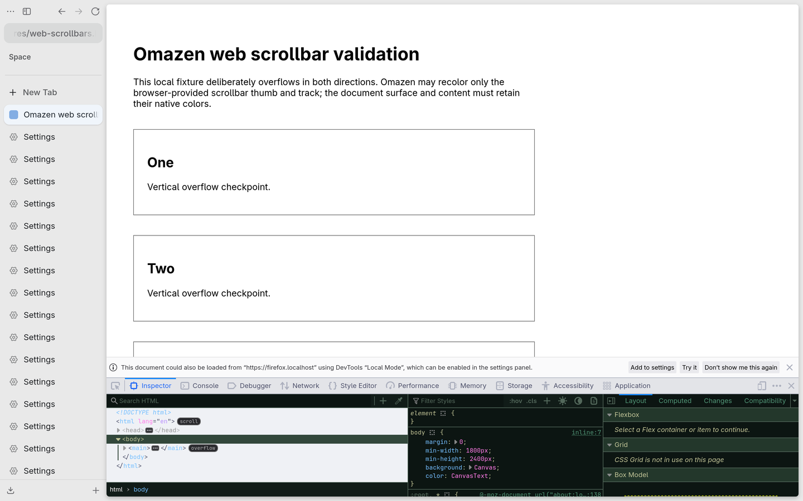 | 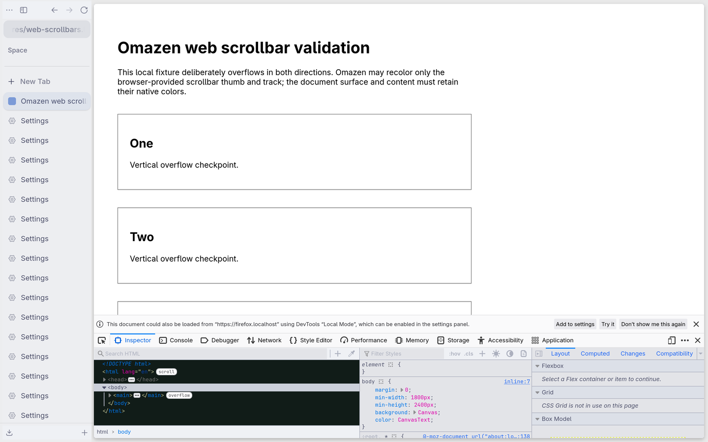 | 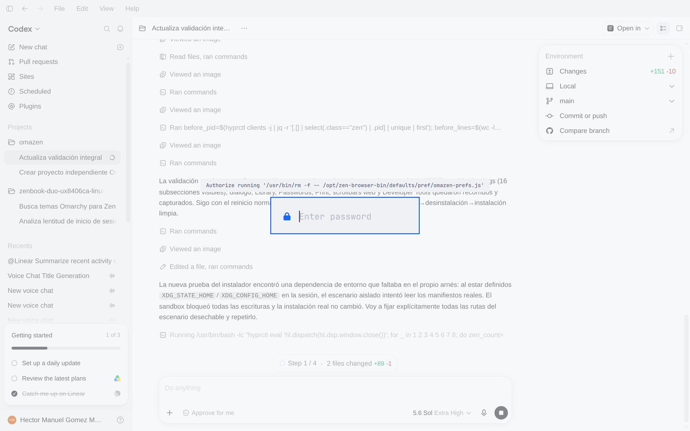 |

### Automated rendered-pixel smoke test

The repository also contains a fast, repeatable browser smoke test for the
production content stylesheet:

```bash
tests/visual-smoke.sh
```

It starts the installed `zen-browser` binary with a disposable profile,
loads `tests/fixtures/visual-smoke.html`, captures a fixed `1000x768` viewport
and checks the rendered pixels for the document surface, header, card, action
button, input, scroll content and scrollbar thumb. This catches invalid or
non-rendering color declarations that selector-presence checks cannot detect.
It never uses the live profile or network. To retain the capture for review:

```bash
OMAZEN_KEEP_VISUAL_OUTPUT=1 \
OMAZEN_VISUAL_OUTPUT_DIR=/tmp/omazen-visual-capture \
  tests/visual-smoke.sh
```

## Reproduction checklist

1. Record `omazen status`, `omazen doctor`, the current theme, Zen version and Zen PID.
2. Open Settings and visit every visible subsection listed in the matrix.
3. With Zen open, switch once to a palette with the opposite `mode`; verify the PID is unchanged and wait for both `PALETTE_APPLIED` and `CHROME_CSS_APPLIED`.
4. Run `omazen disable`, verify native styling returns, then run `omazen enable` and verify the palette returns without a PID change.
5. Exercise the non-destructive auxiliary surfaces: cancel dialogs and Print, do not save or delete credentials/data, and close Library normally.
6. Open `tests/fixtures/web-scrollbars.html`; verify both overflow axes and confirm that page content is not recolored.
7. Close the last Zen window normally, reopen it, and require a new `BRIDGE_LOADED` plus successful CSS application in `bridge.log`.
8. Run `tests/test.sh` for the disposable lifecycle.
9. For a release qualification on a test machine, run the real update, uninstall and clean install; verify exact owned paths before each destructive step and finish with `omazen doctor` plus a normal Zen start.

## Final state

The test machine was left in the supported state:

- Omazen `1.0.0` installed and enabled.
- Zen running with a freshly loaded bridge.
- `omazen doctor`: `0 failure(s), 0 warning(s)` immediately after the clean installation and first start.
- Original Osaka Jade theme restored and applied live.
- The qualification and final documentation-sync backups remain at `~/.local/share/omazen.backup.20260824T163901Z` and `~/.local/share/omazen.backup.20260824T164516Z` for recovery.
